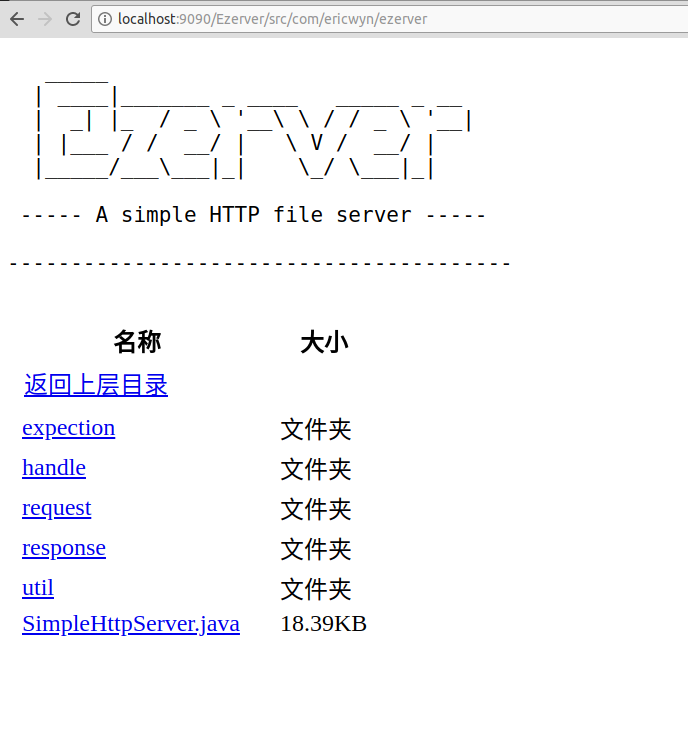

# Ezerver 中文文档

## 介绍

Ezerver 是一个基于 socket 的简易 web 服务器，有了它，你只需要几行 java 代码，就可以使用 java 搭建一个 web  服务器，以此来处理静态的 Http 请求，或者是编写一些 API 请求

# 快速开始
使用 Ezerver 作为静态服务器，以此访问项目根路径下 webroot 中的静态网页文件

运行下面的代码,访问地址是 localhost:9090/index.html，会看到 Ezerver 的欢迎页面了

    SimpleHttpServer server = new SimpleHttpServer.Builder()
                    .allowDebug()
                    .build();
            server.start();

完整的示例在 `test/SimpleStart.java` 里面

------

# Request 与 Response 说明
## Request

## Response

------

# 作为静态服务器使用
## 作为静态网页服务器
使用默认配置, Ezerver 就能开启一个静态文件服务器了,如果你想要设置静态网页服务器的 WEBROOT 的话, 请使用 `Builder.setWebRoot(String webRoot) `方法, 如下

    SimpleHttpServer server = new SimpleHttpServer.Builder()
                    .setWebRoot("/home/www")
                    .allowDebug()
                    .build();
     server.start();

## 作为静态文件服务器
### 允许请求文件夹路径
使用 `Builder.allowShowDirRequest() `方法, Ezerver 将允许用户访问文件夹路径, 当用户的访问 URI 指向一个文件夹时候,例如 `/img` , 那么将会显示一个网页列出当前目录下全部的文件与文件夹, 如下图

Server 开启的代码如下
    
        SimpleHttpServer server = new SimpleHttpServer.Builder()
                        .allowShowDirRequest()
                        .allowDebug()
                        .build();
         server.start();

完整的示例代码在 `/test/FileServerTest.java`

### 自定义网页头部样式
往 `allowShowDirRequest()` 方法当中传入 HTML 代码字符串,可以替换掉默认文件展示页面的头部样式

------

# 编写动态服务
 除了作为开启静态服务器的工具之外, Ezerver 允许用户针对特定 uri 请求进行特定的而返回, 由此完成一些 API 编写或者其他的事务处理
 
## 自定义特殊访问路径处理方法
Ezerver 对于特定访问 uri 的处理方法全部使用 `HandleMethod` 类来开启, 用户只需要新建一个 `HandleMethod` 类的实例, 实现里面的 `requestDo(Request request,Response response)` 方法, 并使用 `Builder.addHandleMethod(HandleMethod method)`将其加入到 Server 里面, 就可以完成对特定 uri 的访问处理.

如下面代码所示, 我们编写一个 `HandleMethod` 完成对来自 `/test` 的请求的处理, 让请求都返回 404 页面.

    HandleMethod method = new HandleMethod("/test") {
        @Override
        public void requestDo(Request request, Response response) throws IOException {
            response.send404Page();
            response.closeStream();
        }
    };

**注意!!!**, 所有的 `requestDo` 方法, 都应在最后调用 `response.closeStream()`

### 使用正则表达式匹配特殊 uri 
使用 `HandleMethod(String uri,boolean matchRegex)` 构造方法且 `matchRegex`参数为 `true`时候, 新建的 `HandleMethod` 对象, 能够使用正则表达式来设置匹配的 uri

### 使用字符串匹配 uri

使用 `HandleMethod(String uri)` 构造方法新建的 `HandleMethod` 对象, 将限定该 `HandleMethod` 只对该 uri 起作用

注意, 当使用 字符串匹配 uri 新建的 `HandleMethod` 与使用正则表达式匹配 uri 方式新建的`HandleMethod` 出现冲突的时候, 使用字符串匹配 uri 的 `HandleMethod` 将拥有更高的优先权. 

## 接受请求参数
`Ezerver` 能够接受带有请求参数的 GET 请求以及 POST 请求, 并且解析请求存放到 `Request` 的 `HashMap<String,RequestParam> paramMap` 当中

### 获取请求参数
使用`Request.getParamMap()` 就能够获取到 request 里面的请求参数了, 支持 GET 请求的 uri 参数, POST 请求的话, 只支持一下三种 `Content-Type` 传送过来的参数

 - `multipart/form-data`
 支持键值对形式的参数解析, 注意:不支持解析文件请求
 - `application/x-www-form-urlencoded`
 支持键值对形式参数解析
 - `application/json`
 支持 json 数据获取

### 获取 JSON 请求数据
当 POST 请求的 `Content-Type` 设置为 `application/json` 的时候, Request 将会保存请求体当中的整串 `Json` 串到 `Request.JSONParamString` 当中, 方便用户后续使用 Json 序列化工具解析

## 直接返回 HTML 文本/文件
Ezerver 的 `HandleMethod` 里面可以使用 `Response.sendHtmlFile(File htmlFile)`直接返回 HTML 文件

## 直接返回 JSON 数据
Ezerver 的 `HandleMethod` 里面可以使用 `Response.sendJsonData(String json)`直接返回 JSON 数据串，配合 JSON 序列化工具，就能实现返回对象 JSON 的功能了

## 直接返回文件
Ezerver 也支持直接调用 `Response.sendFileStream(File file)` 方法，直接往客户端返回文件流

## 直接返回 404 错误页面
Ezerver 当前只支持返回 404 页面，使用 `Response.send404Page()` 就可以了，后期开发和版本里面会加入更多的返回页面和返回 code

## 关闭当前请求连接
使用 `Response.closeStream()` 关闭当前的连接，该方法会先关闭好 Request 的 Reader ，然后关闭 Response 的 Writer，最后再关闭 Socket，执行完之后会将他们全部指向 null

# 服务器开启与关闭
## Builder
## 关闭服务器

# 日志打印

------

# 使用示例

